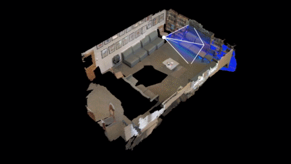
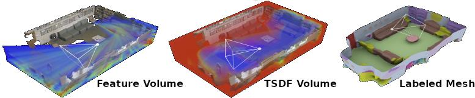

# ATLAS: End-to-End 3D Scene Reconstruction from Posed Images

### [Project Page](http://zak.murez.com/atlas) | [Paper](https://arxiv.org/abs/2003.10432) | [Video](https://youtu.be/9NOPcOGV6nU) | [Models](https://drive.google.com/file/d/12P29x6revvNWREdZ01ufJwMFPl-FEI_V/view?usp=sharing) | [Sample Data](https://drive.google.com/file/d/13-D7QNVZjj864E768zJ7IWDDqY6agUES/view?usp=sharing)

[Zak Murez](http://zak.murez.com), 
[Tarrence van As](https://github.com/tarrencev),
[James Bartolozzi](http://jhb.graphics),
Ayan Sinha,
Vijay Badrinarayanan, and 
Andrew Rabinovich




## Quickstart
We provide a [Colab Notebook](https://colab.research.google.com/drive/19_kJSkrQqPhQGIWpEpbZlk48b8p5ZRTO?usp=sharing) to try inference.

## Installation
We provide a docker image `Docker/Dockerfile` with all the dependencies.

Or you can install them yourself:
```
conda install -y pytorch=1.5.0 torchvision=0.6.0 cudatoolkit=10.2 -c pytorch
conda install opencv
pip install \
  open3d>=0.10.0.0 \
  trimesh>=3.7.6 \
  pyquaternion>=0.9.5 \
  pytorch-lightning>=0.8.5 \
  pyrender>=0.1.43
python -m pip install detectron2 -f https://dl.fbaipublicfiles.com/detectron2/wheels/cu102/torch1.5/index.html
```
For 16bit mixed precision (default training setting) you will also need [NVIDIA apex](https://github.com/NVIDIA/apex)
```
git clone https://github.com/NVIDIA/apex
pip install -v --no-cache-dir --global-option="--cpp_ext" --global-option="--cuda_ext" ./apex
```

For headless rendering with pyrender (used for evaluation) see installation instructions [here](https://pyrender.readthedocs.io/en/latest/install/index.html).

For inference with COLMAP see installation instructions [here](https://colmap.github.io/).

(If you have problems running the code try using the exact versions specified... for example the pytorch-lightning API has not settled yet).

## Data Preperation
#### Sample
We provide a small [sample scene](https://drive.google.com/file/d/13-D7QNVZjj864E768zJ7IWDDqY6agUES/view?usp=sharing) for easy download and rapid inference.
Download and extract the data to `DATAROOT`. The directory structure should look like:
```
DATAROOT
└───sample
│   └───sample1
│       │   intrinsics.txt
│       └───color
│       │   │   00000001.jpg
│       │   │   00000002.jpg
│       │   │   ...
│       └───pose
│           │   00000001.txt
│           │   00000002.txt
│           │   ...
```
Next run our data preperation script which parses the raw data format into our common json format (more info [here](atlas/datasets/README.md))
(note that we store our derivered data in a seperate folder `METAROOT` to prevent pollution of the original data).
```
python prepare_data.py --path DATAROOT --path_meta METAROOT --dataset sample
```

#### Scannet
Download and extract Scannet by following the instructions provided at http://www.scan-net.org/.
You also need to download the train/val/test splits and the label mapping from https://github.com/ScanNet/ScanNet (Benchmark Tasks).
The directory structure should look like:
```
DATAROOT
└───scannet
│   └───scans
│   |   └───scene0000_00
│   |       └───color
│   |       │   │   0.jpg
│   |       │   │   1.jpg
│   |       │   │   ...
│   |       │   ...
│   └───scans_test
│   |       └───color
│   |       │   │   0.jpg
│   |       │   │   1.jpg
│   |       │   │   ...
│   |       │   ...
|   └───scannetv2-labels.combined.tsv
|   └───scannetv2_test.txt
|   └───scannetv2_train.txt
|   └───scannetv2_val.txt
```
Next run our data preperation script which parses the raw data format into our common json format (more info [here](atlas/datasets/README.md))
(note that we store our derivered data in a seperate folder `METAROOT` to prevent pollution of the original data).
This script also generates the ground truth TSDFs using TSDF Fusion.
```
python prepare_data.py --path DATAROOT --path_meta METAROOT --dataset scannet
```
This will take a while (a couple hours on 8 Quadro RTX 6000's)... if you have multiple gpus you can use the `--i` and `--n` flags to run in parallel
```
python prepare_data.py --path DATAROOT --path_meta METAROOT --dataset scannet --i 0 --n 4 &
python prepare_data.py --path DATAROOT --path_meta METAROOT --dataset scannet --i 1 --n 4 &
python prepare_data.py --path DATAROOT --path_meta METAROOT --dataset scannet --i 2 --n 4 &
python prepare_data.py --path DATAROOT --path_meta METAROOT --dataset scannet --i 3 --n 4 &
```
Note that if you do not plan to train you can prepare just the test set using the `--test` flag.

#### Your own data
To use your own data you will need to put it in the same format as the sample data, or implement your own version of something like [sample.py](atlas/datasets/sample.py). After that you can modify `prepare_data.py` to also prepare your data.
Note that the pretrained models are trained with Z-up metric coordinates and do not generalize to other coordinates (this means that the scale and 2 axes of the orientation ambiguity of SFM must be resolved prior to using the poses).

## Inference
Once you have downloaded and prepared the data (as described above) you can run inference using our pretrained model ([download](https://drive.google.com/file/d/12P29x6revvNWREdZ01ufJwMFPl-FEI_V/view?usp=sharing)) or by training your own (see below).

To run on the sample scene use:
```
python inference.py --model results/release/semseg/final.ckpt --scenes METAROOT/sample/sample1/info.json
```
If your GPU does not have enough memory you can reduce `voxel_dim` (at the cost of possible clipping the scene)
```
python inference.py --model results/release/semseg/final.ckpt --scenes METAROOT/sample/sample1/info.json --voxel_dim 208 208 80
```
Note that the values of voxel_dim must be divisible by 8 using the default 3D network.

Results will be saved to:
```
results/release/semseg/test_final/sample1.ply // mesh
results/release/semseg/test_final/sample1.npz // tsdf
results/release/semseg/test_final/sample1_attributes.npz // vertex semseg
```

To run on the entire Scannet test set use:
```
python inference.py --model results/release/semseg/final.ckpt
```

## Evaluation
After running inference on Scannet you can run evaluation using:
```
python evaluate.py --model results/release/semseg/test_final/
```

Note that `evaluate.py` uses pyrender to render depth maps from the predicted mesh for 2D evaluation.
If you are using headless rendering you must also set the enviroment variable `PYOPENGL_PLATFORM=osmesa`
(see [pyrender](https://pyrender.readthedocs.io/en/latest/install/index.html) for more details).

You can print the results of a previous evaluation run using
```
python visualize_metrics.py --model results/release/semseg/test_final/
```


## Training
In addition to downloadinng and prepareing the data (as described above) you will also need to [download](https://drive.google.com/file/d/15x8k-YOs_65N35CJafoJAPiftyX4Lx5w/view?usp=sharing) our pretrained resnet50 weights (ported from [detectron2](https://github.com/facebookresearch/detectron2)) and unnzip it.

Then you can train your own models using `train.py`.

Configuration is controlled via a mix of config.yaml files and command line arguments.
We provide a few sample config files used in the paper in `configs/`.
Experiment names are specified by `TRAINER.NAME` and `TRAINER.VERSION`, which default to `atlas` and `default`.
See config.py for a full list of parameters.

```
python train.py --config configs/base.yaml TRAINER.NAME atlas TRAINER.VERSION base
```
```
python train.py --config configs/semseg.yaml TRAINER.NAME atlas TRAINER.VERSION semseg
```

To watch training progress use
```
tensorboard --logdir results/
```

## COLMAP Baseline
We also provide scripts to run inference and evaluataion using COLMAP. Note that you must install [COLMAP](https://colmap.github.io/) (which is included in our docker image).

For inference on the sample scene use
```
python inference_colmap.py --pathout results/colmap --scenes METAROOT/sample/sample1/info.json
```
and for Scannet
```
python inference_colmap.py --pathout results/colmap
```

To evaluate Scannet use
```
python evaluate_colmap.py --pathout results/colmap
```

## Citation

```
@inproceedings{murez2020atlas,
  title={Atlas: End-to-End 3D Scene Reconstruction from Posed Images},
  author={Zak Murez and 
          Tarrence van As and 
          James Bartolozzi and 
          Ayan Sinha and 
          Vijay Badrinarayanan and 
          Andrew Rabinovich},
  booktitle = {ECCV},
  year      = {2020},
  url       = {https://arxiv.org/abs/2003.10432}
}
```
